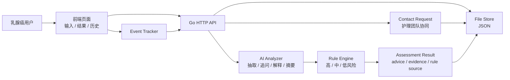

# Breast Cancer Side Effect Agent

乳腺癌治疗副作用 AI 增强分诊最小可运行原型。用户输入副作用描述后，系统返回风险等级、下一步建议、是否建议联系团队、依据说明、命中规则、生成时间和规则版本号。

> 安全边界：本项目是系统设计和工程原型，不替代医生诊断。AI 不直接决定最终风险等级，最终等级由可审计规则引擎输出。

## 功能覆盖

- 前端页面：用户输入页、结果页、历史记录页。
- 后端接口：提交评估、获取结果、获取历史、创建协同请求、关闭评估、事件埋点。
- 风险规则：高风险 / 中风险 / 低风险，内置规则版本 `breast-side-effect-rules-v0.1.0`。
- AI 能力：症状结构化抽取、动态追问、用户可读解释、护理团队交接摘要、安全输出审查、规则优化建议。
- 数据存储：本地 JSON 文件，包含 `assessment`、`advice`、`evidence`、`rule_source`、`event_log`、`contact_request`。
- 可观测性：内置 `assessment_started`、`assessment_submitted`、`result_viewed`、`contact_team_clicked`、`assessment_closed`。
- 审计：每次结果保留命中规则、生成时间、版本号、命中关键词和 AI 结构化线索。

## 快速启动

```bash
cd /Users/xingjun.liu/work/test/breast-cancer-side-effect-agent
go run ./cmd/server
```

访问：

```text
http://localhost:8080
```

健康检查：

```bash
curl -sS http://localhost:8080/api/healthz
```

## 启用 DeepSeek AI

未配置 `DEEPSEEK_API_KEY` 时，系统使用本地 heuristic fallback，仍可完整运行。配置后会按照 DeepSeek 官方 OpenAI-compatible Chat Completions API 调用 `deepseek-v4-flash`。

```bash
export DEEPSEEK_API_KEY="your_deepseek_api_key"
export DEEPSEEK_MODEL="deepseek-v4-flash"
export DEEPSEEK_BASE_URL="https://api.deepseek.com"
export DEEPSEEK_THINKING="disabled"
go run ./cmd/server
```

兼容旧的 OpenAI-compatible 配置：如果没有 `DEEPSEEK_API_KEY`，系统会读取 `OPENAI_API_KEY`、`OPENAI_MODEL`、`OPENAI_BASE_URL`。

可选配置：

```bash
export PORT=8080
export STORE_PATH=data/store.json
export STATIC_DIR=internal/httpapi/static
```

## 项目结构

```text
.
├── cmd/server/main.go
├── data/store.json
├── docs/
│   ├── AI_TECHNICAL_DESIGN.md
│   ├── API.md
│   ├── OPERATIONS.md
│   └── RULES_AND_AUDIT.md
├── internal/
│   ├── ai/
│   ├── domain/
│   ├── httpapi/
│   ├── rules/
│   └── store/
└── go.mod
```

## 架构图



## 数据流

1. 用户打开输入页，前端记录 `assessment_started`。
2. 用户提交副作用描述，前端调用 `POST /api/assessments`。
3. 后端调用 AI Analyzer 抽取症状、体温、严重程度线索、缺失字段和追问。
4. Rule Engine 使用原文和 AI 结构化结果进行高 / 中 / 低风险判定。
5. AI Explanation Generator 基于规则结果生成用户可读解释，并经过安全审查。
6. 后端保存 assessment、advice、evidence、rule_source 和事件日志。
7. 用户进入结果页，前端调用 `GET /api/assessments/{id}` 并记录 `result_viewed`。
8. 用户点击联系团队，后端创建 contact request，并生成护理团队交接摘要。
9. 用户关闭评估，后端记录 `assessment_closed`。
10. 历史页通过 `GET /api/history?user_id=demo-user` 查询历史。

## 典型输入

高风险：

```text
我今天发热 38.5 度，还有寒战
```

中风险：

```text
我有点恶心，腹泻了两次，但还能喝水
```

低风险：

```text
我最近轻微脱发，有点乏力
```

动态追问：

```text
我有点发烧
```

## 测试

```bash
go test ./...
```

## Git 初始化和远端

本工程已按以下目标初始化：

```bash
git init
git branch -M main
git remote add origin https://github.com/kn-ll/breast-cancer-side-effect-agent.git
git add .
git commit -m "Initial breast cancer side effect agent prototype"
```

推送需要本机 GitHub 凭证：

```bash
git push -u origin main
```

## 文档入口

- [AI Technical Design](docs/AI_TECHNICAL_DESIGN.md)
- [API](docs/API.md)
- [Rules and Audit](docs/RULES_AND_AUDIT.md)
- [Operations](docs/OPERATIONS.md)
