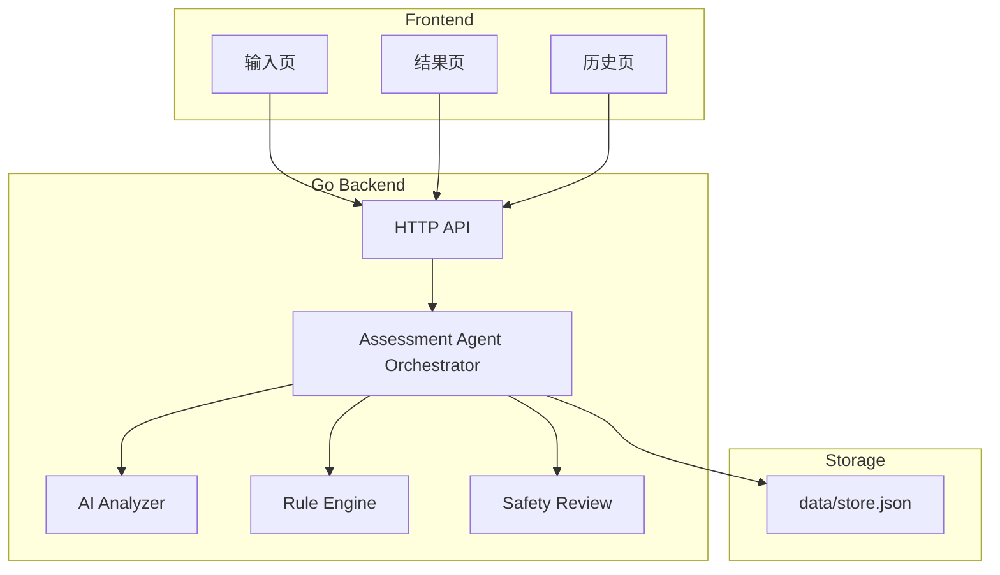
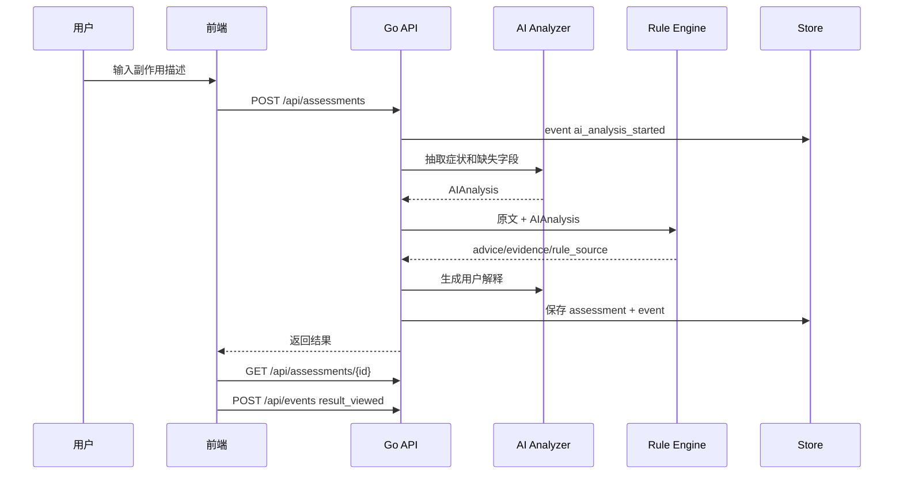

# AI Technical Design

## 1. 目标

构建一个最小可运行原型，支持乳腺癌治疗用户输入副作用描述，系统返回：

- 风险等级：`high` / `medium` / `low`
- 下一步建议
- 是否建议联系团队
- 简单依据说明
- 命中规则、生成时间、规则版本号

设计原则：

- AI 做理解、追问、解释和摘要。
- 规则引擎做最终风险判定。
- 所有结果可审计、可复盘、可版本化。

## 2. 系统架构



组件说明：

- `Frontend`：原生 HTML/CSS/JS，覆盖输入、结果、历史。
- `HTTP API`：Go `net/http` 实现，无外部依赖。
- `AI Analyzer`：OpenAI-compatible adapter，有 key 时调用模型，无 key 时 fallback。
- `Rule Engine`：内置规则表，按优先级输出风险等级。
- `Safety Review`：检查 AI 文本是否包含不安全建议。
- `File Store`：本地 JSON 文件，保存评估、事件、协同请求和规则优化建议。

## 3. 核心流程



## 4. AI 能力设计

### 4.1 症状结构化抽取

输入：

```text
昨晚开始发烧 38.4，还有腹泻三次，今天有点头晕
```

输出：

```json
{
  "summary": "用户从昨晚开始发热 38.4°C，伴腹泻和头晕。",
  "symptoms": ["fever", "diarrhea", "dizziness"],
  "temperature_celsius": 38.4,
  "duration": "昨晚",
  "severity_signals": ["fever_38_plus"],
  "missing_fields": ["hydration_status"],
  "follow_up_questions": ["现在是否能正常喝水？尿量是否明显减少？"]
}
```

### 4.2 动态追问

当用户描述缺少关键字段时，AI 最多返回 3 个追问。

例：

```text
用户：我有点发烧
追问：
1. 最高体温是多少？是否达到或超过 38°C？
2. 这些症状从什么时候开始，持续了多久？
3. 是否伴随寒战、胸痛、呼吸困难、伤口红肿或化脓？
```

高风险场景不会因为追问而延迟风险提示。

### 4.3 用户可读解释

AI 基于规则结果生成解释，但不新增诊断。

约束：

- 必须引用命中规则事实。
- 不允许建议自行停药、换药、加药。
- 高风险必须保留就医或联系团队路径。

### 4.4 护理团队交接摘要

用户点击“联系团队”时生成：

```text
患者报告发热 38.5°C 并伴寒战。系统判定高风险，命中规则 H002_HIGH_FEVER_OR_INFECTION。建议确认近期血常规、中性粒细胞状态、当前用药、饮水和尿量情况，并尽快联系患者。
```

### 4.5 规则优化建议

接口 `POST /api/rule-suggestions` 基于历史评估和事件日志生成建议，但只作为人工复盘输入，不自动修改规则。

## 5. 感知-决策-执行-学习闭环

### 感知

实现：

- 前端收集用户描述、追问回答和页面事件。
- AI Analyzer 抽取症状、体温、持续时间、严重程度信号和缺失字段。
- 事件日志记录用户是否查看结果、联系团队、关闭评估。

技术：

- HTML/CSS/JS
- Go `net/http`
- OpenAI-compatible Chat Completions
- 本地 heuristic fallback

### 决策

实现：

- 规则引擎读取原始描述和 AIAnalysis。
- 按优先级匹配高风险、中风险、低风险规则。
- 输出 `advice`、`evidence`、`rule_source`。

技术：

- Go 内置规则表
- 关键词匹配
- 体温阈值解析
- 规则版本 `breast-side-effect-rules-v0.1.0`

### 执行

实现：

- 返回风险等级、下一步建议、是否联系团队。
- 结果页展示用户解释和审计信息。
- 点击联系团队创建 `contact_request`，生成团队交接摘要。
- 关闭评估记录状态和事件。

技术：

- REST API
- 本地 JSON Store
- 前端结果页

### 学习

实现：

- 保存 assessment、event_log、contact_request。
- 生成规则优化建议，供人工复盘。
- MVP 不做自动在线学习，避免医疗安全风险。

技术：

- `data/store.json`
- `POST /api/rule-suggestions`
- 人工审核后发布新规则版本

## 6. 安全边界

- 系统不输出诊断。
- 系统不建议用户自行停药、换药、加药。
- AI 不允许降低规则引擎给出的风险等级。
- 高风险必须提示线下就医或 24 小时内联系团队。
- 所有结果必须包含命中规则、生成时间和版本号。
